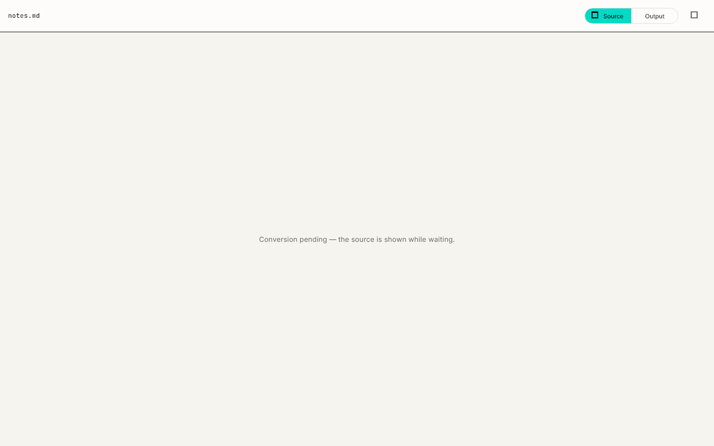

# MarkIt

A **document → Markdown** converter for desktop (Windows / macOS / Linux) and web.

**Fast, 100% local, zero cloud, zero API calls.** The target use case is large
books and documents (hundreds of pages) that need to be converted into
structured Markdown (headings / paragraphs / lists / tables) so they can be
read, indexed, and fed to AI systems as input (RAG / LLM).

## Key features

- **8 format families** — Word, PowerPoint, Excel, OpenDocument, RTF, EPUB,
  CSV, PDF — all defined in one catalog (`lib/core/format_catalog.dart`, the
  single source of truth for extensions, detection, picker filters, and the
  About screen list).
- **Format detection from content, not just names** — magic bytes for PDF,
  ZIP containers, OLE2 compound files, and RTF, plus extension fallback.
  ZIP-based families (DOCX/PPTX/XLSX/ODT/EPUB) are distinguished by inspecting
  the ZIP entry names, so renamed files are still detected correctly.
- **Convertible today**: PDF (two-pass heuristic pipeline), Word
  (`.docx` / `.docm` via `DocxExtractor`), and CSV (via `CsvExtractor`).
- **Graceful "not supported yet"** — PowerPoint/Excel/OpenDocument/RTF/EPUB
  and legacy OLE2 formats (`.doc` / `.ppt` / `.pps` / `.pot` / `.xls` /
  `.xlsb`) are detected and selectable, but fail with a clear per-file message
  without blocking the rest of the batch. Conversion for these families is on
  the roadmap.
- **Two-pass PDF pipeline** — a cheap text pass builds a per-document font
  histogram; a full layout pass extracts positioned text spans. Structure
  thresholds are derived from the document's own statistics, not hardcoded.
- **Streaming output** — pages are written and flushed as they are converted,
  so memory stays flat even on 800-page documents (measured ΔRSS ≈ 10 MB).
- **Concurrent batch conversion** — files in the queue run concurrently on a
  single persistent worker isolate (desktop) or inline on the main isolate
  (web), with per-file progress and cancel.
- **100% offline** — fonts are bundled as assets; every conversion happens on
  the device. No uploads, no cloud, no accounts.

## Workflow

- **Batch queue** — add files via drag & drop (multi-file) or the file
  picker; dedupe by path; remove individual files; per-file status chips
  (queued / converting / done / failed / cancelled).
- **Conversion** — the queue is processed concurrently on one persistent
  worker isolate (desktop) or inline with frame yielding (web). pdfrx/PDFium
  is not safe to spawn/teardown repeatedly within one process, so a single
  worker lives for the whole app session (see `docs/spike-pdfrx.md`); the
  page-count probe runs only before the first worker is spawned.
- **Progress & cancel** — per-file progress (page N of M), elapsed time,
  pages/s, and a cancel action that stops the active job and marks the rest
  of the queue as cancelled.
- **Source preview** — before conversion, each file shows its source: PDF
  pages, raw text (CSV / RTF), or the main content text of ZIP-based formats
  (DOCX / PPTX / XLSX / ODT / EPUB). After conversion, toggle between the
  **Rendered** Markdown and **Raw** output.
- **Saving results** — desktop: output files land in a per-batch temp
  directory; pressing **Save** lets you choose a destination folder (existing
  files are surfaced in a conflict dialog, and per-file "Open folder" /
  "Copy path" actions stay consistent). Web: output is downloaded as a Blob,
  individually or as a ZIP.
- **Error handling per file** — corrupt / encrypted / scanned (no-text)
  files, unsupported formats, or failing extractors fail that file
  individually with a `JobErrorView` showing full error details; the rest of
  the batch continues.
- **Theme switcher** — light / dark / system, persisted via
  `shared_preferences`.

## Screenshots





## Download

[](https://github.com/Ezherielll/MarkIt/releases/latest)
[](https://github.com/Ezherielll/MarkIt/releases)

Desktop builds (Windows / macOS / Linux) are published as GitHub Releases
whenever a version tag (`vX.Y.Z`) is pushed — see
`docs/desktop-release.md`. Grab **v1.2.0** from
[github.com/Ezherielll/MarkIt/releases/latest](https://github.com/Ezherielll/MarkIt/releases/latest).

| Platform | Package | How to run |
|----------|---------|------------|
| Windows | `markit-windows-x64-v1.2.0.zip` | Extract and run `markit.exe`. If SmartScreen shows "Unknown publisher", click **More info → Run anyway** (the build is unsigned). |
| macOS | `markit-macos-arm64-v1.2.0.dmg` | Open the DMG and drag **markit** to Applications. Because it is unsigned, right-click the app and choose **Open** the first time (or run `xattr -cr /Applications/markit.app`). Apple Silicon only. |
| Linux | `markit-linux-x64-v1.2.0.tar.gz` | Extract and run `./markit` from the `bundle` folder. |

Prefer not to download? Try the [web demo](https://ezherielll.github.io/MarkIt/)
instead — same app, runs in the browser, no install.

## Architecture

The conversion pipeline lives under `lib/core/` as pure Dart modules (no
Flutter dependency), which keeps it fully unit-testable:

```
PDF:      PdfrxSource  →  DocStats  →  LineGrouper  →  ParagraphJoiner
                                     →  StructureClassifier  →  MarkdownWriter
Word/CSV: FormatExtractor (DocxExtractor / CsvExtractor) → MarkdownWriter
```

1. **PdfrxSource** — abstraction over the PDF engine (pdfrx / PDFium).
   Pass 1 (`loadLight`) reads raw text + line-height per page for the font
   histogram; pass 2 (`loadFull`) reads positioned text spans (bounding
   boxes + a font-size proxy, see `docs/spike-pdfrx.md`).
2. **DocStats** — per-document statistics (font histogram, gap statistics)
   from which structure thresholds are derived.
3. **LineGrouper** — groups text fragments into lines using y-coordinate
   clustering, in left-to-right reading order.
4. **ParagraphJoiner** — merges lines into paragraphs using the median of
   *small* inter-line gaps (the plain global median is contaminated by
   paragraph-to-paragraph gaps).
5. **StructureClassifier** — marks lines as heading / paragraph / list item
   from the document statistics; `TableDetector` + `ColumnSplitter` handle
   tables and multi-column layouts.
6. **MarkdownWriter** — emits Markdown, streaming one page at a time
   (UTF-8, no BOM, `\n` line endings — verified at the byte level).

Format knowledge is centralized: `lib/core/format_catalog.dart` defines the 8
families, their extensions, and ZIP entry hints, and everything else
(detection, picker filter, About screen list) is derived from it. Non-PDF
formats plug in via a pure-Dart `FormatExtractor` registered in
`lib/core/extractors/extractor_registry.dart` — no FFI, works offline on both
desktop and web.

**Execution routing** (`lib/isolate/`) uses conditional imports: on desktop a
persistent background isolate runs the conversion executor (one worker for the
whole app session); on web the same executor runs inline on the main isolate.
`ConversionController` owns the batch queue, probing, cancel, and per-batch
temp output directory. Preview work is kept off the UI thread with `compute()`
isolates (source loading and output-file reads), and `FrameCoalescer` throttles
controller rebuilds so the sidebar stays responsive during conversion.

## Project structure

```
lib/
├── main.dart                         # entry point
├── app.dart                          # MaterialApp + routing
│
├── core/                             # Pure Dart, no Flutter dependency
│   ├── format_catalog.dart           # single source of truth for formats
│   ├── input_format.dart             # format enum + detectFormat
│   ├── pdf_source.dart               # PdfSource abstraction (loadLight/loadFull)
│   ├── pdfrx_source.dart             # pdfrx/PDFium implementation
│   ├── doc_stats.dart                # per-document statistics
│   ├── line_grouper.dart             # y-clustering into lines
│   ├── paragraph_joiner.dart         # gap-statistic paragraph merging
│   ├── structure_classifier.dart     # heading / list classification
│   ├── table_detector.dart           # table region detection
│   ├── column_splitter.dart          # multi-column reading order
│   ├── markdown_writer.dart          # streaming Markdown output
│   ├── converter.dart                # pipeline orchestration
│   ├── output.dart                   # MdSink / OutputTarget (file, memory)
│   ├── output_mover.dart             # temp → destination move plans
│   ├── zip_text_preview.dart         # main-content text for ZIP formats
│   ├── text_truncate.dart            # preview truncation
│   ├── errors.dart                   # ConvertException
│   └── extractors/                   # pure-Dart format extractors
│       ├── extractor_registry.dart   # per-format extractor lookup
│       ├── docx_extractor.dart       # Word .docx/.docm
│       └── csv_extractor.dart        # CSV → Markdown table
│
├── isolate/                          # execution routing (conditional imports)
│   ├── conversion_controller.dart    # batch queue / probe / cancel / temp dir
│   ├── conversion_executor.dart      # executor interface
│   ├── conversion_executor_factory*.dart  # io / web / stub factories
│   ├── isolate_executor.dart         # persistent worker (desktop)
│   ├── inline_executor.dart          # inline main isolate (web)
│   ├── convert_isolate.dart          # worker entry point
│   └── messages.dart                 # worker protocol
│
├── models/
│   ├── pdf_input.dart                # file or in-memory bytes
│   └── layout.dart
│
├── theme/
│   └── theme_controller.dart         # light / dark / system persistence
│
├── i18n/
│   └── strings.dart                  # all UI strings (English)
│
└── ui/
    ├── screens/
    │   ├── home_screen.dart          # main two-panel screen
    │   └── about_screen.dart
    ├── source/                       # source preview (pre-conversion)
    │   ├── source_loader.dart        # format-aware source loading
    │   ├── pdf_source_view.dart      # PDF page preview
    │   └── text_source_view.dart     # raw text preview
    ├── widgets/
    │   ├── document_viewer.dart      # rendered / raw output (cached paper)
    │   ├── document_load_work.dart   # output read + stats via compute()
    │   ├── left_panel.dart           # lazy sidebar file list
    │   ├── drop_zone.dart            # drag & drop / picker
    │   ├── file_card.dart            # per-file status row
    │   ├── job_error_view.dart       # full error details
    │   ├── stat_chip.dart            # structure stats
    │   ├── markdown_helpers.dart     # preview + MdStats
    │   └── header/                   # app header (brand, toolbar, status)
    ├── frame_coalescer.dart          # rebuild throttling
    ├── download_text.dart / download_zip.dart   # Blob download (web) / no-op (desktop)
    └── theme/                        # markit_theme, palette, typography, spacing
```

## Performance

- **Responsive UI during conversion** — controller notifications are
  coalesced per frame (`FrameCoalescer`), the sidebar renders a lazy
  `ListView.builder`, and the rendered output "paper" subtree is cached per
  (job, preview mode) so ongoing batch updates never rebuild the viewer.
- **Heavy work off the UI thread** — conversion runs on a persistent worker
  isolate (desktop) or an inline executor that yields frames (web); source
  loading and output-file reads run in `compute()` isolates.
- **Measured numbers** (Windows 11 · i5/i7-class · 16 GB RAM · NVMe SSD,
  synthetic corpus — details in `docs/benchmark.md`):
  - **800 synthetic pages: 7.8 s total** (pass 1 ≈ 570 ms, pass 2 ≈ 7.3 s),
    ΔRSS 10 MB, peak RSS 379 MB — the planned isolate pool was **skipped**
    because single-threaded streaming conversion was already fast enough.
  - **Corpus (latest run, 2026-08-13):** book_single paragraph F1 100%,
    nested headings 100%, numbered sections 100%, ordered lists 100%, nested
    lists 100%, header/footer suppression 100%, multi-column reading order
    100%, and simple / mixed / multi-page tables 100% (table cell F1).
    The `with_tables` corpus still scores 28.6% (FAIL) — the remaining table
    gap.

## Development

### Prerequisites

- Flutter SDK (this project targets Dart SDK `^3.12.2`)
- A desktop toolchain for the platform you target (e.g. Visual Studio on Windows)
- **Rust toolchain** for local Windows builds (`super_native_extensions`
  builds a native asset via cargokit — install with
  `winget install --id Rustlang.Rustup -e`; CI runners already have it)

### Build & run

```sh
flutter pub get
flutter run -d windows        # run in debug mode (also: macos / linux / chrome)
flutter build windows --release
flutter build web --release --base-href /MarkIt/   # --base-href /MarkIt/ is required for GitHub Pages
```

Web deployment is automatic on every push to `master` (see `docs/web-deploy.md`).

### Test, analyze & benchmark

```sh
flutter analyze               # static analysis (flutter_lints)
flutter test                  # unit / widget / integration tests
flutter test --update-goldens test/widget/screenshot_golden_test.dart   # regen goldens

# Synthetic corpus + golden evaluation (pure Dart):
dart run benchmark/make_corpus.dart    # generate PDFs + golden files (one-time)
dart run benchmark/run_corpus.dart     # convert + evaluate every file in the corpus
dart run benchmark/run_benchmark.dart  # performance decision gate (800 pages by default)
dart run tool/check_complexity.dart    # cognitive complexity gate (≤ 15)
```

Benchmark results live in `docs/benchmark.md`; the M0 exit criteria live in
`docs/mvp_checklist.md`.

## Documentation

- `docs/mvp_checklist.md` — M0 exit criteria (FR-01…12) and confirmed technical decisions.
- `docs/benchmark.md` — performance decision gate and corpus evaluation runs.
- `docs/spike-pdfrx.md` — pdfrx API spike notes (no `fontSize` API → the
  line-height proxy; PDFium is not safe to spawn/teardown repeatedly in one
  process → one persistent worker + probe only before the first worker).
- `docs/known-issues.md` — known framework/app issues and their status.
- `docs/multi-format.md` — multi-format conversion implementation status.
- `docs/multi-format-plan.md` — multi-format conversion implementation plan.
- `docs/desktop-release.md` — desktop release workflow (GitHub Releases).
- `docs/web-deploy.md` — web deployment guide (GitHub Pages).
- `docs/web-m1.md` — web platform milestone notes.
