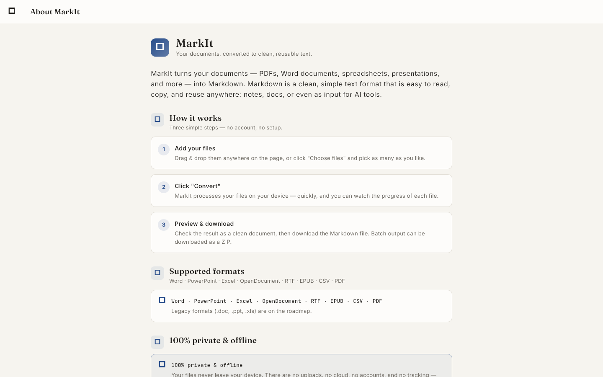

# MarkIt

A **document → Markdown** converter for desktop (Windows / macOS / Linux) and web.

**Fast, 100% local, zero cloud, zero API calls.** The target use case is large
books and documents (hundreds of pages) that need to be converted into
structured Markdown (headings / paragraphs / lists) so they can be read,
indexed, and fed to AI systems as input (RAG / LLM).

## Overview

- **Desktop Flutter app** — runs natively on Windows, macOS, and Linux.
- **Two-pass conversion pipeline** (see [Pipeline](#pipeline)):
  1. A cheap text pass to build a per-document font histogram.
  2. A full layout pass that extracts positioned text spans and writes
     Markdown page-by-page.
- **Structure is classified from document statistics** — thresholds are derived
  from the document itself, not hardcoded.
- **Streaming output** — pages are written and flushed as they are converted,
  so memory stays flat even on 800-page documents (measured ΔRSS ≈ 10 MB).
- **Multi-file batch queue** — drop or pick any number of supported documents
  (PDF, TXT, MD, CSV, JSON, XML, HTML), review the queue (per-file status,
  remove), then convert them all sequentially with a single "Convert all"
  action.
- **Multi-format input** — format detection from magic bytes + extension
  (ZIP-based containers like DOCX/XLSX/PPTX/EPUB are distinguished by
  inspecting the ZIP entries), with a dedicated pure-Dart extractor per format
  (see [Project structure](#project-structure)).
- **Background isolate** — the UI stays responsive while conversion runs, with
  per-file progress (file N of M), per-page progress, elapsed time, pages/s,
  and a cancel button.

## Screenshots




## Features (MVP)

### Extraction & layout
- Text + layout extraction via **pdfrx** (PDFium backend) — positioned word
  spans with bounding boxes and a font-size proxy (line-height, see
  `docs/spike-pdfrx.md`).
- Single-threaded conversion with streaming writes (no page accumulation).
- **Format extractors** for TXT / MD / CSV / JSON / XML / HTML (pure Dart,
  no FFI — they run offline on desktop and web): fatal errors are raised as
  `ConvertException` (the batch keeps going), partial content is written
  as-is with warnings, and progress / cancel are checked per item.

### Format detection
- `InputFormat.detectFormat` combines strong magic bytes (PDF, ZIP-based,
  image, audio) with the extension, and inspects ZIP entry names so that
  renamed DOCX/XLSX/PPTX/EPUB files are still detected.
- DOCX / XLSX / PPTX / EPUB / ZIP / image / audio are *detected* but not yet
  converted — they are part of the Fase 2–3 roadmap and fail with a clear
  "not supported yet" message.

### Structure classification (stats-based, not hardcoded)
- Two-level **headings** detected from a per-document body-font histogram
  (0.5 pt buckets + windowed mode).
- **Paragraphs** joined using a gap statistic — the median of *small* inter-line
  gaps times a factor (the plain global median is contaminated by
  paragraph-to-paragraph gaps).
- Simple **bullet lists**, including continuation lines.

### UX & robustness
- **Batch queue** — add files via drag & drop (multi-file) or the file
  selector; dedupe by path; remove individual files; per-file status chips
  (queued / converting / done / failed / cancelled).
- **Sequential batch processing** — one file at a time on a single persistent
  background isolate (pdfrx/PDFium is not safe to spawn/teardown repeatedly
  within one process — see `docs/spike-pdfrx.md`).
- Per-file progress, elapsed time, pages/s, and a **cancel** action
  (completes in < 1 s; the partial `.partial` file is removed; the rest of the
  queue is marked cancelled).
- **Error handling** per file — a corrupt / encrypted / password-protected /
  scanned (no-text) PDF, an undetectable or unsupported format, or a failing
  extractor fails that file individually without stopping the batch, plus
  failed-page collection.
- Result **summary** — per-file status, structure statistics, and an
  **overwrite confirmation** dialog (once per batch).
- **100% offline** — fonts are bundled as assets; conversion runs entirely in a
  background isolate.

## Getting started

### Prerequisites
- Flutter SDK (this project targets Dart SDK `^3.12.2`)
- A desktop toolchain for the platform you target (e.g. Visual Studio on Windows)

### Build & run

```sh
flutter pub get
flutter run -d windows        # run in debug mode
flutter build windows         # build a release binary
flutter run -d chrome         # run the web version (also: macos / linux)
flutter build web --release   # build the web release
```

Replace `windows` with `macos` or `linux` for other platforms.

### Web

- **Live demo (GitHub Pages):** https://ezherielll.github.io/markit/
- Deployed automatically via GitHub Actions on every push to `master` (see
  `docs/web-deploy.md`).
- Web supports: multi-file, drag & drop, rendered Markdown preview,
  **download output** (Blob), theme switcher, 100% offline (wasm + bundled
  fonts).
- Web vs desktop differences: output is downloaded (not saved to disk);
  conversion runs inline on the main isolate; files are read into memory.

### Test, analyze & benchmark

```sh
flutter analyze               # static analysis (flutter_lints)
flutter test                  # unit / widget / integration tests

# Synthetic corpus + golden evaluation (requires pdfrx_engine, pure Dart):
dart run benchmark/make_corpus.dart    # generate PDFs + golden files (one-time)
dart run benchmark/run_corpus.dart     # convert + evaluate every file in the corpus
dart run benchmark/run_benchmark.dart  # performance decision gate (800 pages by default)
```

Results and the M0 checklist live in `docs/benchmark.md` and
`docs/mvp_checklist.md`.

## Pipeline

The conversion pipeline lives under `lib/core/` as pure Dart modules (no
Flutter dependency), which keeps it fully unit-testable:

```
PDF:  PdfSource (pdfrx)  →  LineGrouper  →  ParagraphJoiner  →  StructureClassifier
                                                                       │
Other formats: FormatExtractor (per-format) ───────────────────────────┤
                                                                       ▼
                                                          MarkdownWriter  →  Converter
```

1. **PdfSource** — abstraction over the PDF engine. Pass 1
   (`loadLight`) reads raw text + line-height per page for the font histogram;
   pass 2 (`loadFull`) reads positioned text spans.
2. **LineGrouper** — groups text fragments into lines using y-coordinate
   clustering, in left-to-right reading order.
3. **ParagraphJoiner** — merges lines into paragraphs using the gap statistic
   described above.
4. **StructureClassifier** — marks lines as heading / paragraph / list item
   using the document statistics computed by `DocStatsComputer`.
5. **FormatExtractor** — for non-PDF formats, a pure-Dart extractor per
   format emits Markdown blocks directly (raw text, tables, code fences,
   headings, lists).
6. **MarkdownWriter** — emits Markdown, streaming one page at a time
   (UTF-8, no BOM, `\n` line endings — verified at the byte level).

## Project structure

```
lib/
  core/          → pure Dart pipeline (no Flutter dependency, unit-testable)
      pdfrx layout pipeline:  pdf_source → line_grouper → paragraph_joiner
                              → structure_classifier → doc_stats
                              → converter → output
      multi-format layer:     input_format → extractor
                              → extractors/{text,csv,json,xml,html,registry}
                              → markdown_writer
  isolate/        → execution routing
      ├─ conversion_executor_factory  (conditional import per platform)
      │      → isolate_executor  → persistent worker (convert_isolate + messages)
      │      → inline_executor   → web (main isolate)
      └─ conversion_controller  → batch queue, cancel, probe
  models/         → TextSpan / Line / Block / PdfInput (path | bytes)
  theme/          → ThemeController (light / dark / system, persisted)
  ui/
    screens/      → home (empty → queue → running → summary), about
    widgets/      → app header (brand lockup, toolbar), drop zone, file card,
                    progress & result panels, document viewer (preview + raw),
                    markdown helpers, stat chips
    theme/        → ink/paper palette, typography (Fraunces / Inter /
                    JetBrains Mono), spacing, MarkIt light & dark
    download_*.dart  → platform-conditional helpers (Blob download on web)
  i18n/           → string tables (localization, English)
assets/fonts/     → bundled font assets (offline-safe)
web/              → web entry (index.html splash, manifest, icons)
benchmark/        → headless harness → golden evaluator
corpus/           → synthetic PDFs, golden files, and conversion output
test/
  unit/           → pipeline, extractors, input_format, executors, stats
  widget/         → home screen, header, multi-format preview, golden screenshots
  integration/    → isolate controller + repro tests (desktop-tagged)
  spike/          → pdfrx API probes, concurrency
  helpers/        → PDF fixture factory (buildTestPdf)
docs/             → benchmark results, MVP checklist, pdfrx spike notes,
                    web deploy
```

## UI design ("Document Studio")

- Paper-and-ink palette with a serif display face (**Fraunces**).
- The Markdown preview is rendered like a printed page.
- Drag & drop **multiple** documents, or pick them via the file selector.
- 100% offline — all fonts are bundled as assets.

## Benchmark summary (M0)

Measured on Windows 11 · i5/i7-class · 16 GB RAM · NVMe SSD, 800 synthetic pages:

| Metric            | Target | Result | Status |
|-------------------|--------|--------|--------|
| Total time        | ≤ 55 s | 7.8 s  | ✅ PASS |
| Memory (ΔRSS)     | ≤ 100 MB | 10 MB | ✅ PASS |
| Peak RSS process  | ≤ 400 MB | 379 MB | ✅ PASS |

Because single-threaded streaming conversion is already fast enough, the
planned isolate pool was **skipped** for the MVP. Corpus quality: `book_single`
(60 pages) reaches F1 100% for headings / paragraphs / lists; `with_tables`
scores 28.6% as expected — table support is a v2 baseline (see
`docs/benchmark.md`).

## Documentation

- `docs/mvp_checklist.md` — M0 exit criteria (FR-01…12) and confirmed technical
  decisions.
- `docs/benchmark.md` — performance decision gate and corpus evaluation runs.
- `docs/spike-pdfrx.md` — pdfrx API spike notes (no `fontSize` API → the
  line-height proxy; PDFium is not safe to spawn/teardown repeatedly in one
  process → one persistent worker + probe only before the first worker).
